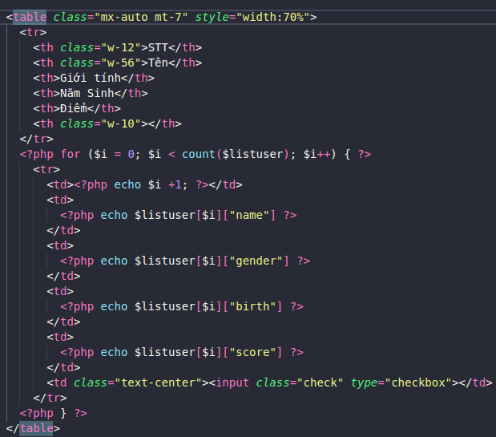
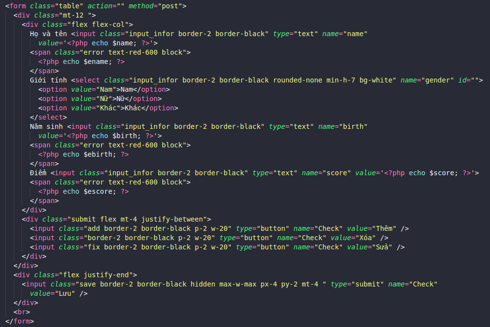
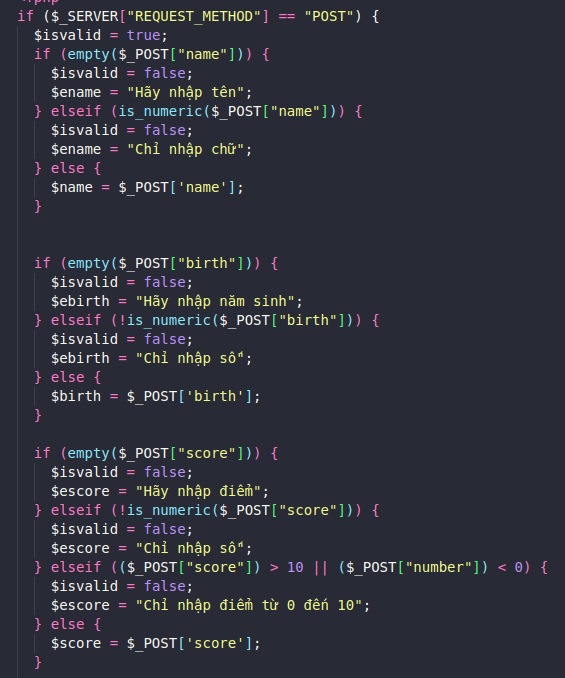

# Tạo danh sách
Người thực hiện: Nguyễn Tuấn Nguyên
## Trong bài bao gồm:
1. Tạo 1 danh sách bao gồm tên, giới tính, năm sinh, điểm số
    - 
1. Tạo phần nhập dự liệu vào danh sách
    - 
1. Kiểm tra dữ liệu nhập
    - 